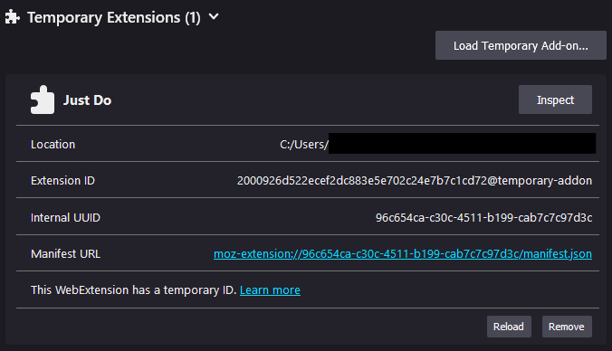
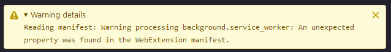
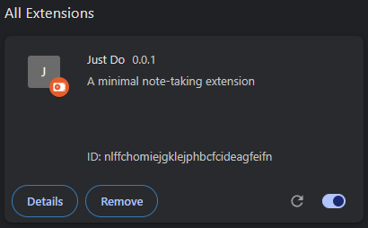
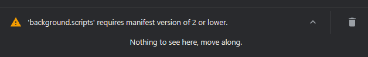

# Installation
1. Create a folder to hold the project data
2. In a terminal, run ```git clone https://github.com/Itsskiip/just-do.git```
3. Enter the newly created directory named ```just-do```

# Testing in the browser
## Mozilla Firefox
To install it on Firefox, follow these steps:
1. In your address bar, go to ```about:debugging#/runtime/this-firefox```
2. Click the ```Load Temporary Add-on...``` button
3. In the popup dialog, navigate to the directory of this file and open ```manifest.json```
4. You should see the extension loaded as a temporary file:

   > The following error may appear, this is expected and is due to the cross-compatibility with chrome. 
5. After making any changes to the file, click on ```reload``` button

## Google Chrome
To install it on Chrome, follow these steps:
1. In your address bar, go to ```chrome://extensions/```
2. At the upper-right of your window, enable ```developer mode```

3. Click on the ```Load Unpacked``` button
4. In the popup dialog, navigate to the directory of this file and click ```Select Folder```
5. You should see the extension loaded:

   > The following error may appear, this is expected and is due to the cross-compatibility with firefox. 
6. After making any changes to the file, click the  button

# Making changes
1. Create a new branch with ```git checkout -b BRANCH_NAME```
   1. (Replace BRANCH_NAME with the name of your feature)
2. Make your changes
3. Stage changes in your directory with ```git add .```
4. Commit with message: ```git commit -am "commit message here"```
5. Push your branch to github: ```git push -u origin BRANCH_NAME```
6. Create a ```Pull Request``` on Github or just let everyone know that you have changes ready to be merged

# Setup for A/B testing
## Seeding
1. Open ```seed/seed.csv``` in a text or spreadsheet editor
2. Make changes to the file
3. Run ```seed/build_seed.py```. You can do this from the CLI with ```python -m seed/build_seed.py```
4. This will generate ```seed/tags.json``` and ```seed/tasks.json```
5. Ensure that ```scripts/logger.js``` is set up to load the seed as described below.

## Preperation for deployment
1. In ```scripts/logger.js```, set the constants:
   1. ```testmode``` to ```true```
   2. ```debug``` to ```true``` to force seed loading for testing purposes. Before sending it to users, ensure it is set back to ```false```
   3.  ```testType``` to ```A``` for tags, or ```B``` for no tags.

2. Add all files into a zip folder and send it to the user.